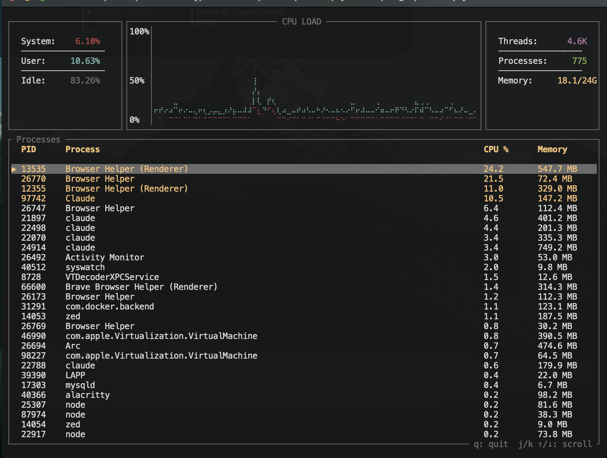

# syswatch

A lightweight terminal system monitor for macOS, built in Rust with [ratatui](https://github.com/ratatui/ratatui).



## Features

- **CPU Load** — real-time chart with system (red) and user (cyan) split, 3-minute sliding window
- **System stats** — system/user/idle CPU percentages, thread count, process count, memory usage
- **Process table** — all processes sorted by CPU usage, scrollable with keyboard
- **Lightweight** — ~10 MB RSS vs ~90 MB for Activity Monitor

## Install

```sh
git clone git@github.com:Cleroy288/syswatch.git
cd syswatch
cargo build --release
```

Optionally add an alias to your shell:

```sh
echo 'alias sysmonitor="/path/to/syswatch/target/release/syswatch"' >> ~/.zshrc
```

## Usage

```sh
cargo run --release
# or, if aliased:
sysmonitor
```

| Key | Action |
|-----|--------|
| `q` / `Esc` | Quit |
| `j` / `Down` | Scroll down |
| `k` / `Up` | Scroll up |

## Dependencies

- [ratatui](https://crates.io/crates/ratatui) — terminal UI framework
- [crossterm](https://crates.io/crates/crossterm) — terminal event handling
- [sysinfo](https://crates.io/crates/sysinfo) — process and memory info
- macOS `mach` and `libproc` APIs — CPU split and thread counts

## Requirements

- macOS (uses Darwin-specific APIs)
- Rust 1.85+

## License

MIT
